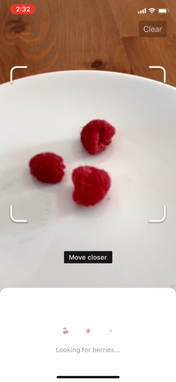
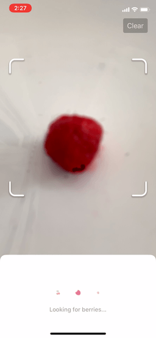

# Removing data entry from food tracking

**A demo app with a custom vision model that identifies food and volume. Trained on autogenerated images without the use of any user data.**

Understanding and managing diet is a very complex, difficult, and important problem for myself and for everyone. Diet accounts for [over 20% of deaths][0] and contributes greatly to lost healthy years of life. Individuals and researchers lack the information to understand our [unique responses to foods][1] and that won't change until food tracking is as easy as fully automated health tracking like step counting, heart rate monitoring, and sleep tracking. It's just too difficult to track every single time you eat, to understand what's in your food, and to accurately estimate mass without a scale.

[0]:http://ihmeuw.org/4na4
[1]:https://www.ncbi.nlm.nih.gov/pubmed/26590418

I spent 2018 finding ways to make an AR future that I'd want to live in — one that can provide the health benefits of always on computer vision without the unacceptable compromise of training on a live stream of people's lives. If privacy reasons weren't enough, user data is biased, increasingly more costly to label, made obsolete by new sensors and techniques, and doesn't extend well to temporal models.

#### Disclaimers
The compromises made reflect that this is a proof of concept demo.
- **Incomplete model, fresh raspberries and strawberries only**
  - Trained very close, in focus objects to let me tackle risk factors one at a time
  - Labels are autogenerated and could be separate per berry but are currently in one layer (semantic segmentation). Ideally the model would identify each berry separately (instance segmentation), instead of performing _terribly_ slow post processing to achieve the same result
  - No temporal or depth data
- **Poor mass estimation**
  - Area is estimated from pixel count and a single length measurement
  - Area -> mass is based on averages from a literal handful of real world priors
  - Doesn't handle obscured objects
  - If scene tracking is confused, we could easily estimate you have 500 berries
- **Lack of flexibility**
  - The way I sample the video stream, some text, and the app's layout all rely on the device being an iPhone X/XS
  - Since I'm only handling 2 berries, the nutritional view at the bottom is hardcoded
- **Poor tracking and adjusting**
  - I'm not accounting for significant jitter and drift: berries can float off 20 feet behind you, out of sight
  - I'm not using confidence that an object is absent to correct for earlier mistakes or drift
  - I'm not using predictions over time to improve accuracy
  - Different food objects can't currently be close to each other (a drift handling hack)
  - Recognized food is not gracefully animated or tracked, it flickers in and out each model run

#### More examples

Rough mass estimation:

Model speed without separating instances with slow post processing that should just be in the model (no smoothing or attempts to realign, iPhone XS):

Failure from lack of training on out of focus images:

